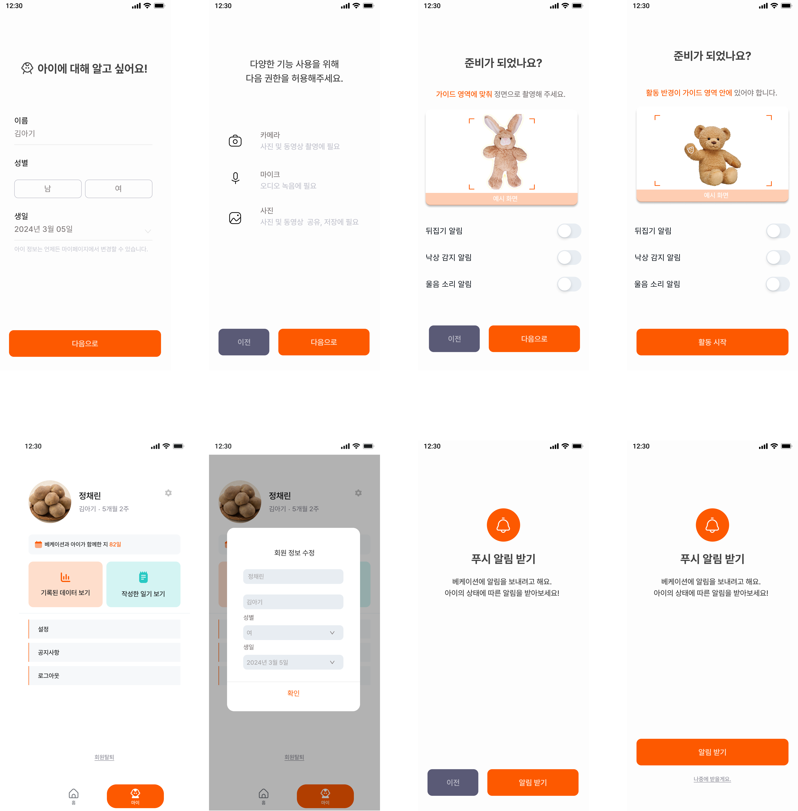
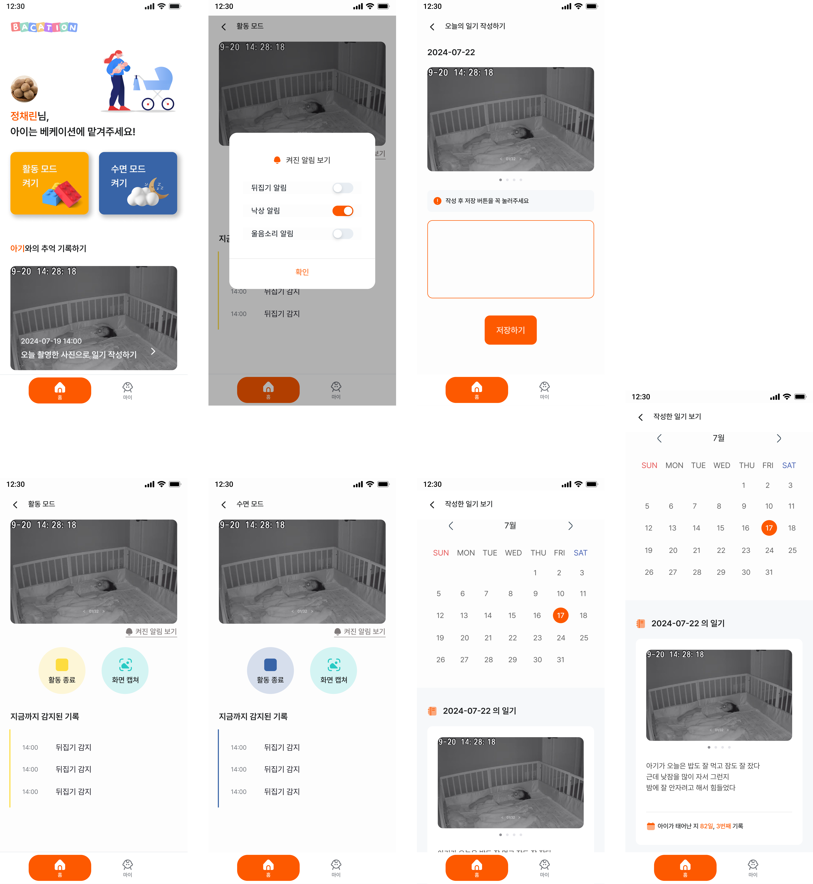
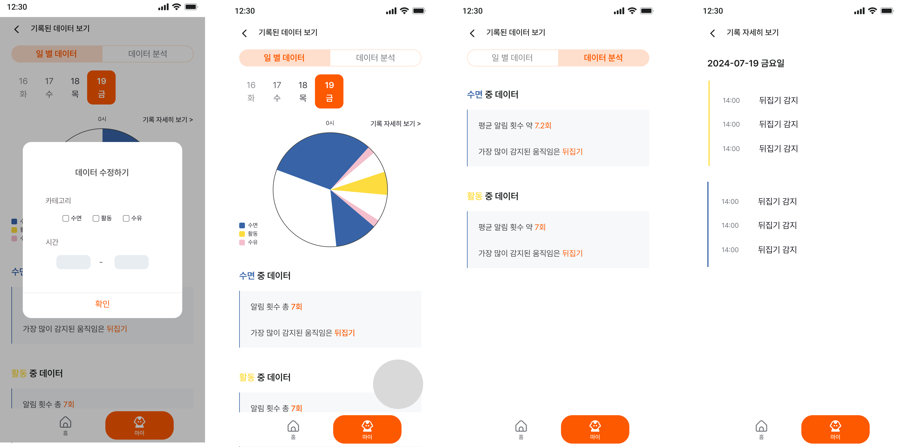

# 👶 Bacation

## 🖥 기술 스택
### [FrontEnd]
> - Typescript
> - React
> - Vite
> - zustand
> - TailwindCSS
> - Tanstack Query
> - PWA

### [webRTC]

> - openvidu

### npm 설치
```sh
npm install --legacy-peer-deps
npm install
```

### Compile and Hot-Reload for Development

```sh
npm run dev
```

### Compile and Minify for Production

```sh
npm run build
```
---

## 👩‍👧‍👦 FE 팀원 역할

### [손유진]
>- push 알림 기능
>- 모드별 알람 설정 기능
>- 온보딩 및 유저 사용 설명 페이지 
>- 초기 설정 페이지
>- 마이페이지

### [정채린]
>- UI, UX 디자인 및 PWA
>- 다이어리 작성 기능
>- 다이어리 캘린더 기능
>- 메인 페이지 
>- 관찰(모드) 페이지 

### [김태한]
> - Openvidu를 사용한 비디오 캠 기능
> - teachable machine 모델 연결 기능
> - 수면 및 활동 데이터 분석 기능
> - 관찰(모드) 페이지
> - 데이터 분석 페이지
---

## 🎨 UI/UX 디자인 (Figma)

#### [온보딩 및 로그인 화면]


#### [초기 설정 화면]


#### [관찰 모드 및 다이어리 화면]


#### [활동 데이터 분석 화면]


## 🚀 FE Git Branch 전략

### branch

```sh
(master) -> (FE / BE) -> (feature/feature명)
```

* master : 배포 가능한 상태로 유지
* FE / BE  
    * FE : Frontend 개발 branch
        * Fetaure : 기능별 branch
        
    * BE : Backend 개발 branch
        * Fetaure : 기능별 branch

### commit

```sh
[타입] 설명 으로 구성

| 타입   | 설명              
---------------------- 
| `FEAT` | 새로운 기능 추가  
| `FIX`  | 수정              

    예시]
        [FEAT] 로그인 페이지 구현 
        [FIX] 로그인 페이지 함수 수정
```

### merge

```bash
merge 하기 전에 현재 작업 진행 상황 공유
merge 후 불필요한 branch 지우기
```
------------------
## 🧾 프로젝트 구조

```
📦src
 ┣ 📂assets
 ┣ 📂components
 ┃ ┣ 📂atoms
 ┃ ┃ ┣ 📂addTimeButton
 ┃ ┃ ┣ 📂imageSlide
 ┃ ┃ ┣ 📂ovVideo
 ┃ ┃ ┗📂topBar
 ┃ ┣ 📂molecules
 ┃ ┃ ┣ 📂dateFormat
 ┃ ┃ ┣ 📂modalSelectCategory
 ┃ ┃ ┣ 📂modalSetTime
 ┃ ┃ ┣ 📂teachableImage
 ┃ ┃ ┣ 📂teachableMotion
 ┃ ┃ ┗ 📂userVideoComponent
 ┃ ┣ 📂organism
 ┃ ┃ ┣ 📂analysisData
 ┃ ┃ ┣ 📂button
 ┃ ┃ ┣ 📂chart
 ┃ ┃ ┣ 📂chartModal
 ┃ ┃ ┣ 📂dataPageTab
 ┃ ┃ ┣ 📂day
 ┃ ┃ ┣ 📂detailData
 ┃ ┃ ┣ 📂diaryCalendar
 ┃ ┃ ┣ 📂diaryView
 ┃ ┃ ┣ 📂KakaoCallback
 ┃ ┃ ┣ 📂mainButton
 ┃ ┃ ┣ 📂mainDiary
 ┃ ┃ ┣ 📂mainTop
 ┃ ┃ ┣ 📂navigation
 ┃ ┃ ┗ 📂openViduSession
 ┃ ┣ 📂templates
 ┣ 📂fonts
 ┣ 📂pages
 ┃ ┣ 📂childInfoPage
 ┃ ┣ 📂dataPage
 ┃ ┣ 📂detailPage
 ┃ ┣ 📂diaryPage
 ┃ ┣ 📂diaryWritePage
 ┃ ┣ 📂initialSettingsPage
 ┃ ┣ 📂loginPage
 ┃ ┣ 📂mainPage
 ┃ ┣ 📂mainPage
 ┃ ┣ 📂modePage
 ┃ ┣ 📂myPage
 ┃ ┣ 📂onboardingPage
 ┃ ┣ 📂permissionPage
 ┃ ┣ 📂roomInPage
 ┃ ┣ 📂usageGuidePage
 ┣ 📂store
 ┃ ┣ 📜useChartModalStore.ts
 ┃ ┣ 📜useDataStore.ts
 ┃ ┣ 📜useDiaryStore.ts
 ┃ ┣ 📜useFcmStore.ts
 ┃ ┣ 📜useUserStore.ts
 ┃ ┗📜useViduStore.ts
 ┣ 📂stories
 ┣ 📜App.tsx
 ┣📜.prettierrc
 ┗📜vite.config.ts
 
 ```


